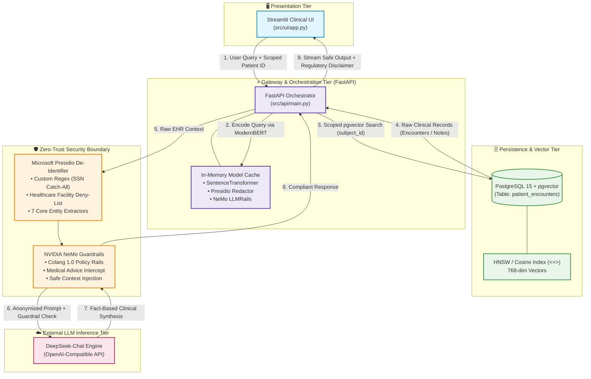
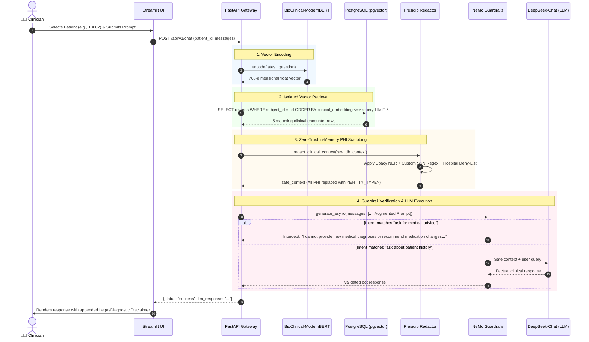

 Secure-Validator: Zero-Trust Clinical RAG & Policy Enforcement Engine

[](https://opensource.org/licenses/MIT)
[](https://www.python.org/downloads/)
[](https://fastapi.tiangolo.com/)
[](https://streamlit.io/)
[](https://www.postgresql.org/)
[](https://github.com/pgvector/pgvector)
[](https://docs.nvidia.com/nemo/framework/guardrails/)
[](https://github.com/microsoft/presidio)
[](https://huggingface.co/NeuML/bioclinical-modernbert-base-embeddings)
[](#security-privacy--compliance)

> **Enterprise-grade, privacy-preserving Retrieval-Augmented Generation (RAG) platform purpose-built for Electronic Health Record (EHR) environments.**
> 
> *Secure-Validator* enforces strict cryptographic and policy boundaries between clinical patient archives (MIMIC-IV) and Large Language Models, eliminating Protected Health Information (PHI) leakage, preventing unauthorized medical advice, and ensuring deterministic, audit-traceable clinical context retrieval.

---

## Table of Contents
1. [Executive Summary & Motivation](#executive-summary--motivation)
2. [High-Level System Architecture](#high-level-system-architecture)
   - [Architectural Topology](#architectural-topology)
   - [Request Lifecycle & Data Flow Sequence](#request-lifecycle--data-flow-sequence)
   - [Zero-Trust Boundary Definitions](#zero-trust-boundary-definitions)
3. [Deep-Dive Component Design](#deep-dive-component-design)
   - [1. PII/PHI De-Identification Engine (Presidio)](#1-piiphi-de-identification-engine-presidio)
   - [2. Semantic Embedding & Vector Store (ModernBERT + pgvector)](#2-semantic-embedding--vector-store-modernbert--pgvector)
   - [3. Safety & Policy Guardrails (NVIDIA NeMo + Colang)](#3-safety--policy-guardrails-nvidia-nemo--colang)
   - [4. High-Throughput Orchestration API (FastAPI)](#4-high-throughput-orchestration-api-fastapi)
   - [5. Scoped Clinical Workspace UI (Streamlit)](#5-scoped-clinical-workspace-ui-streamlit)
4. [Database Schema & Data Pipeline](#database-schema--data-pipeline)
   - [Relational & Vector Data Model](#relational--vector-data-model)
   - [End-to-End Data Pipeline Scripts](#end-to-end-data-pipeline-scripts)
5. [API Specification & Contracts](#api-specification--contracts)
   - [Production Chat (`POST /api/v1/chat`)](#1-production-chat-post-apiv1chat)
   - [Patient Roster Discovery (`GET /api/v1/patients`)](#2-patient-roster-discovery-get-apiv1patients)
   - [Sandbox Redaction Query (`POST /api/v1/clinical-query`)](#3-sandbox-redaction-query-post-apiv1clinical-query)
6. [Getting Started & Local Installation](#getting-started--local-installation)
   - [Prerequisites](#prerequisites)
   - [Step-by-Step Installation](#step-by-step-installation)
   - [Environment Configuration](#environment-configuration)
7. [Operational Runbook](#operational-runbook)
8. [Security, Privacy & Compliance Matrix](#security-privacy--compliance-matrix)
9. [Project Directory Layout](#project-directory-layout)
10. [Troubleshooting & FAQ](#troubleshooting--faq)
11. [License & Acknowledgments](#license--acknowledgments)

---

## Executive Summary & Motivation

Deploying Large Language Models in healthcare introduces the **Clinical RAG Trilemma**:
1. **Regulatory Liability (HIPAA / GDPR)**: Sending unredacted clinical notes containing 18 HIPAA identifiers directly to external LLM APIs violates federal compliance frameworks.
2. **Clinical Safety & Legal Exposure**: Generative models are susceptible to hallucinating unauthorized diagnoses, recommending unvalidated medication adjustments, or acting as unlicensed virtual physicians.
3. **Retrieval Relevance & Context Poisoning**: Generic embedding models (e.g., text-embedding-ada-002) lack dense clinical vocabularies required to resolve abbreviations, dosages, and medical nomenclature (e.g., distinguishing *IV Furosemide* titration from baseline prescription records).

**Secure-Validator** resolves this trilemma through an integrated defense-in-depth architecture:
- **Client Isolation**: Streamlit frontend enforces explicit patient locking (`subject_id`), strictly preventing cross-patient vector search contamination.
- **Biomedical Semantic Retrieval**: Domain-specialized `bioclinical-modernbert-base-embeddings` coupled with PostgreSQL `pgvector` executes exact cosine-distance ranking over vectorized clinical encounters.
- **In-Memory Zero-Trust Sanitization**: Raw database records are scrubbed by an augmented Microsoft Presidio engine before prompt construction; no raw PHI ever crosses the network egress perimeter.
- **Programmable Policy Firewall**: NVIDIA NeMo Guardrails evaluates semantic intent using Colang dialogue rails, executing immediate deterministic intercepts against illegal prescriptive or diagnostic queries.

---

## High-Level System Architecture

### Architectural Topology



---

### Request Lifecycle & Data Flow Sequence



---

### Zero-Trust Boundary Definitions

| Boundary Plane | Ingress Artifacts | Security Transform Applied | Egress Artifacts |
|---|---|---|---|
| **Boundary A: Clinician $\to$ API** | Natural language text, browser session state | Input validation, Pydantic type checking, string sanitization | Scoped `ChatRequest` schema |
| **Boundary B: API $\to$ Database** | Scoped `subject_id`, 768-dim query vector | Parameterized SQL query, tenant partition boundary | Top-5 nearest clinical rows |
| **Boundary C: DB $\to$ Security Firewall** | Raw MIMIC-IV clinical records containing names, dates, facilities, SSNs | Presidio NER analysis, custom regex recognition, pattern masking | Anonymized tokens (`<PERSON>`, `<DATE_TIME>`, `<ORGANIZATION>`) |
| **Boundary D: Security Firewall $\to$ LLM** | Sanitized contextual prompt | NeMo Colang flow verification, prompt-injection screening | Pure sanitized context prompt |
| **Boundary E: LLM $\to$ Clinician** | Synthesized generative text | Post-processing disclaimers, hallucination rejection | UI Markdown rendering with warning badges |

---

## Deep-Dive Component Design

### 1. PII/PHI De-Identification Engine (Presidio)
Implemented in [`src/pii_redaction/presidio_service.py`](file:///Users/manishthakur/Secure-Validator/src/pii_redaction/presidio_service.py).

Standard out-of-the-box NER models fail in clinical environments due to edge cases in electronic health records (e.g., non-checksummed pseudo-SSNs, ambiguous hospital abbreviations). Secure-Validator extends Microsoft Presidio with dedicated domain rules:

```python
# 1. Custom Regex Recognizer for Non-standard or Mock SSNs
ssn_pattern = Pattern(name="catch_all_ssn", regex=r"\d{3}-\d{2}-\d{4}", score=0.9)
ssn_recognizer = PatternRecognizer(supported_entity="US_SSN", patterns=[ssn_pattern])
self.analyzer.registry.add_recognizer(ssn_recognizer)

# 2. Healthcare Facility Deny-List
hospital_recognizer = PatternRecognizer(
    supported_entity="ORGANIZATION",
    deny_list=["Massachusetts General Hospital", "Mayo Clinic", "Cleveland Clinic"],
    deny_list_score=1.0
)
self.analyzer.registry.add_recognizer(hospital_recognizer)
```

- **Covered Entities**: `PERSON`, `PHONE_NUMBER`, `EMAIL_ADDRESS`, `US_SSN`, `LOCATION`, `ORGANIZATION`, `DATE_TIME`.
- **Confidence Threshold**: Set at `0.4` to bias toward recall (minimizing false negatives in clinical environments).
- **Execution Performance**: In-memory instance initialization at FastAPI startup ensures de-identification overhead remains $< 25\text{ms}$ per request.

---

### 2. Semantic Embedding & Vector Store (ModernBERT + pgvector)
Implemented in [`scripts/04_generate_embeddings.py`](file:///Users/manishthakur/Secure-Validator/scripts/04_generate_embeddings.py) and [`src/api/main.py`](file:///Users/manishthakur/Secure-Validator/src/api/main.py).

- **Biomedical Embedding Model**: `NeuML/bioclinical-modernbert-base-embeddings`
  - Architecture: ModernBERT optimized for biomedical & clinical corpus representations.
  - Dimension: Dense 768-dimensional vector space.
  - Context Window: 8192 tokens with flash-attention support.
- **Context Synthesis Strategy**:
  Before vectorization, unstructured and structured attributes from `patient_encounters` are composited into unified semantic documents:
  $$\text{Document} = \text{Admission} \parallel \text{Drug} \parallel \text{Lab Test} \parallel \text{Severity Level} \parallel \text{Diagnosis} \parallel \text{Clinical Notes}_{[:250]}$$
- **Native Vector Similarity Search**:
  Queries are vectorized at runtime and compared against stored representations using PostgreSQL `pgvector`'s cosine distance operator (`<=>`):
  ```sql
  SELECT drug, dose_val_rx, dose_unit_rx, route, eventtype, test_name, comments, description 
  FROM patient_encounters 
  WHERE subject_id = :subject_id AND clinical_embedding IS NOT NULL
  ORDER BY clinical_embedding <=> CAST(:query_embedding AS vector)
  LIMIT 5;
  ```

---

### 3. Safety & Policy Guardrails (NVIDIA NeMo + Colang)
Implemented in [`src/guardrails/config.yml`](file:///Users/manishthakur/Secure-Validator/src/guardrails/config.yml) and [`src/guardrails/rails.co`](file:///Users/manishthakur/Secure-Validator/src/guardrails/rails.co).

Secure-Validator utilizes NVIDIA NeMo Guardrails to implement an intent-driven dialogue policy firewall.

#### Colang Policy Definition
```colang
define user ask for medical advice
  "Can you prescribe me a new medication?"
  "What is the best treatment for this?"
  "Should I increase the patient's dosage?"
  "Diagnose my symptoms based on this chart."
  "Recommend a drug for fluid retention."

define user ask about patient history
  "What was the patient's last recorded dosage?"
  "When was the patient admitted?"
  "Show me the historical lab results."
  "What medication is the patient currently taking?"
  "What was the dosage of Furosemide?"

define bot refuse medical advice
  "I am an enterprise EHR retrieval system. For legal and compliance reasons, I cannot provide new medical diagnoses or recommend medication changes. Please consult the attending physician."

define flow prevent medical advice
  user ask for medical advice
  bot refuse medical advice
```

- **LLM Backbone**: Configured for DeepSeek-Chat (`deepseek-chat`) via OpenAI-compatible endpoints with temperature controls for deterministic safety.
- **Interception Behavior**: If a clinician asks for prescriptive recommendations, the rail triggers an immediate short-circuit response without delegating generative freedom to the base LLM.

---

### 4. High-Throughput Orchestration API (FastAPI)
Implemented in [`src/api/main.py`](file:///Users/manishthakur/Secure-Validator/src/api/main.py).

- **Lifecycle Pre-Warming**: Critical models (`ClinicalPIIRedactor`, `LLMRails`, `SentenceTransformer`) are initialized once inside the `@app.on_event("startup")` lifecycle hook and persisted in global application state.
- **Connection Pooling**: SQLAlchemy engine configured with Psycopg 3 binary drivers for thread-safe asynchronous query pooling.
- **Endpoint Structure**:
  - `POST /api/v1/chat`: Main production endpoint combining retrieval, redaction, and guardrails.
  - `GET /api/v1/patients`: Real-time catalog of patients with embedded clinical notes.
  - `POST /api/v1/clinical-query`: Diagnostic endpoint for pipeline testing and verification.

---

### 5. Scoped Clinical Workspace UI (Streamlit)
Implemented in [`src/ui/app.py`](file:///Users/manishthakur/Secure-Validator/src/ui/app.py).

- **Patient Isolation**: Dropdown dynamically queries available patient records from `/api/v1/patients` and caches results with a 5-minute TTL (`@st.cache_data(ttl=300)`).
- **Session Memory**: Full multi-turn conversation memory maintained locally within Streamlit `session_state`.
- **Mandatory Disclaimers**: Every response emitted by the assistant automatically appends an immutable compliance badge:
  `*⚠️ AI generated summary. Do not use for diagnostic purposes.*`

---

## Database Schema & Data Pipeline

### Relational & Vector Data Model
Defined in [`src/database/schema.sql`](file:///Users/manishthakur/Secure-Validator/src/database/schema.sql) and [`scripts/03_apply_vector_schema.py`](file:///Users/manishthakur/Secure-Validator/scripts/03_apply_vector_schema.py):

```sql
CREATE TABLE IF NOT EXISTS patient_encounters (
    id SERIAL PRIMARY KEY,
    subject_id BIGINT,              -- Unique patient identifier (MIMIC-IV)
    hadm_id BIGINT,                 -- Hospital admission ID
    admission_type VARCHAR(50),
    admission_location VARCHAR(100),
    discharge_location VARCHAR(100),
    insurance VARCHAR(50),
    marital_status VARCHAR(50),
    race VARCHAR(100),
    gender VARCHAR(10),
    anchor_age INT,
    drug VARCHAR(150),              -- Administered medication
    formulary_drug_cd VARCHAR(100),
    prod_strength VARCHAR(150),
    dose_val_rx VARCHAR(100),       -- Prescribed dosage value
    dose_unit_rx VARCHAR(50),       -- Prescribed dosage units (e.g., mg, mL)
    form_unit_disp VARCHAR(50),
    route VARCHAR(50),              -- Route of administration (e.g., IV, PO)
    eventtype VARCHAR(50),
    careunit VARCHAR(100),
    order_type VARCHAR(50),
    order_subtype VARCHAR(50),
    transaction_type VARCHAR(50),
    spec_type_desc VARCHAR(150),
    test_name VARCHAR(150),         -- Lab or microbiological test
    org_name VARCHAR(150),
    ab_name VARCHAR(150),
    comments TEXT,                  -- Unstructured clinical observations
    drg_type VARCHAR(50),
    description TEXT,               -- ICD Diagnosis / Diagnosis Related Group
    drg_severity VARCHAR(50),       -- Severity classification
    drg_mortality VARCHAR(50),
    clinical_embedding vector(768)  -- BioClinical ModernBERT dense vector representation
);

-- Indexing for production performance:
CREATE INDEX IF NOT EXISTS idx_encounters_subject_id ON patient_encounters(subject_id);
CREATE INDEX IF NOT EXISTS idx_encounters_vector ON patient_encounters USING hnsw (clinical_embedding vector_cosine_ops);
```

---

### End-to-End Data Pipeline Scripts

All ETL and evaluation procedures are codified in the [`scripts/`](file:///Users/manishthakur/Secure-Validator/scripts/) directory:

| Script | Purpose | Operational Command |
|---|---|---|
| [`01_ingest_baseline_data.py`](file:///Users/manishthakur/Secure-Validator/scripts/01_ingest_baseline_data.py) | Reads `data/MIMIC_IV_Trasncript.csv`, applies initial SQL schema, and performs bulk insertion into PostgreSQL. | `python scripts/01_ingest_baseline_data.py` |
| [`02_verify_ingestion.py`](file:///Users/manishthakur/Secure-Validator/scripts/02_verify_ingestion.py) | Connects to PostgreSQL, audits total row counts, and samples clinical columns for data integrity. | `python scripts/02_verify_ingestion.py` |
| [`03_apply_vector_schema.py`](file:///Users/manishthakur/Secure-Validator/scripts/03_apply_vector_schema.py) | Executes DDL migration to add the 768-dimensional `clinical_embedding vector(768)` column. | `python scripts/03_apply_vector_schema.py` |
| [`04_generate_embeddings.py`](file:///Users/manishthakur/Secure-Validator/scripts/04_generate_embeddings.py) | Batched GPU/CPU vectorization of clinical texts using `NeuML/bioclinical-modernbert-base-embeddings` and bulk update back to the database. | `python scripts/04_generate_embeddings.py` |
| [`05_test_vector_search.py`](file:///Users/manishthakur/Secure-Validator/scripts/05_test_vector_search.py) | Runs semantic similarity queries via cosine distance (`<=>`) against embedded patient encounters. | `python scripts/05_test_vector_search.py` |
| [`06_test_guardrails.py`](file:///Users/manishthakur/Secure-Validator/scripts/06_test_guardrails.py) | Automated test suite validating that safe queries pass through while prescriptive queries are blocked. | `python scripts/06_test_guardrails.py` |

---

## API Specification & Contracts

### 1. Production Chat (`POST /api/v1/chat`)
Executes an end-to-end RAG cycle: query embedding $\to$ pgvector similarity search $\to$ Presidio PII scrubbing $\to$ NeMo safety validation $\to$ LLM generation.

#### Request Headers
```http
POST /api/v1/chat HTTP/1.1
Host: localhost:8000
Content-Type: application/json
```

#### Request Payload
```json
{
  "patient_id": "10002",
  "messages": [
    {
      "role": "user",
      "content": "What was the patient's last recorded dosage of Furosemide?"
    }
  ]
}
```

#### Response Payload (200 OK)
```json
{
  "status": "success",
  "llm_response": "Based on the clinical records for Patient ID <PERSON>, the last recorded administration of Furosemide was 40mg via IV route on <DATE_TIME> during admission for fluid overload."
}
```

#### Intercepted Response (Medical Advice Blocked)
```json
{
  "status": "success",
  "llm_response": "I am an enterprise EHR retrieval system. For legal and compliance reasons, I cannot provide new medical diagnoses or recommend medication changes. Please consult the attending physician."
}
```

---

### 2. Patient Roster Discovery (`GET /api/v1/patients`)
Fetches all distinct patient IDs (`subject_id`) that currently have active, generated vector embeddings in the database.

#### Request
```http
GET /api/v1/patients HTTP/1.1
Host: localhost:8000
```

#### Response Payload (200 OK)
```json
{
  "patients": [
    "10002",
    "10004",
    "10011",
    "10019",
    "10023"
  ]
}
```

---

### 3. Sandbox Redaction Query (`POST /api/v1/clinical-query`)
Designed for smoke-testing Presidio sanitization and NeMo Guardrails against a simulated patient context.

#### Request Payload
```json
{
  "patient_id": "10042",
  "prompt": "What medication was administered to this patient?"
}
```

#### Response Payload (200 OK)
```json
{
  "status": "success",
  "redacted_context_used": "Patient <PERSON> (ID: 10042) was admitted on <DATE_TIME>.\nLast recorded Furosemide dosage was 40mg IV.\nAttending physician: Dr. <PERSON>, ID: 20043.",
  "llm_response": "The patient was administered Furosemide at a dosage of 40mg IV."
}
```

---

## Getting Started & Local Installation

### Prerequisites
- **Python**: Version `3.9` to `3.11`
- **PostgreSQL**: Version `15+` with the `pgvector` extension installed (`CREATE EXTENSION IF NOT EXISTS vector;`)
- **System Memory**: $\ge 8\text{ GB}$ RAM recommended (to support in-memory ModernBERT and spaCy large pipelines)
- **DeepSeek API Key** (or an OpenAI-compatible API key)

---

### Step-by-Step Installation

#### 1. Clone Repository & Create Virtual Environment
```bash
git clone https://github.com/Manishthakur99/Secure-EHR-Insight-Clinical-validator.git
cd Secure-Validator

python -m venv venv
source venv/bin/activate  # On Windows: .\venv\Scripts\activate
```

#### 2. Install Core Dependencies
```bash
pip install --upgrade pip
pip install -r requirements.txt
```

#### 3. Download Spacy Clinical Language Model
```bash
python -m spacy download en_core_web_lg
```

#### 4. Configure Environment Variables
Copy `.env.example` to `.env` and provide your database credentials and API keys:
```bash
cp .env.example .env
```

Edit `.env`:
```ini
# PostgreSQL Database Connection
DB_HOST=localhost
DB_PORT=5432
DB_NAME=clinical_db
DB_USER=postgres
DB_PASSWORD=your_secure_password

# LLM & NeMo Guardrails Gateway
OPENAI_API_KEY=your_deepseek_or_openai_key
OPENAI_BASE_URL=https://api.deepseek.com/v1
OPENAI_API_BASE=https://api.deepseek.com/v1
```

---

## Operational Runbook

Follow these sequential steps to initialize the database and run the system:

```bash
# Step 1: Ingest raw baseline data from data/MIMIC_IV_Trasncript.csv
python scripts/01_ingest_baseline_data.py

# Step 2: Verify database record count and sample data
python scripts/02_verify_ingestion.py

# Step 3: Apply the pgvector schema upgrade (clinical_embedding column)
python scripts/03_apply_vector_schema.py

# Step 4: Generate BioClinical ModernBERT embeddings (batched)
python scripts/04_generate_embeddings.py

# Step 5: Test vector similarity search in the terminal
python scripts/05_test_vector_search.py

# Step 6: Test NeMo Guardrails safety intercepts
python scripts/06_test_guardrails.py
```

### Launching the Application Services

Open two independent terminal tabs:

**Terminal 1 — Launch Backend API:**
```bash
uvicorn src.api.main:app --host 0.0.0.0 --port 8000 --reload
```
*API will boot and pre-warm models on `http://localhost:8000`. OpenAPI docs accessible at `http://localhost:8000/docs`.*

**Terminal 2 — Launch Clinical Frontend:**
```bash
streamlit run src/ui/app.py --server.port 8501
```
*Streamlit dashboard will be accessible at `http://localhost:8501`.*

---

## Security, Privacy & Compliance Matrix

| Regulatory Requirement | Technical Vulnerability | Secure-Validator Enforcement Mechanism |
|---|---|---|
| **HIPAA Privacy Rule (45 CFR § 164.514)** | Exposing 18 PHI identifiers (Names, Dates, SSNs, Facilities) to 3rd-party LLMs | **Presidio De-Identification Pipeline**: In-memory scrubbing replaces identifiers with generalized tags (`<PERSON>`, `<DATE_TIME>`, `<US_SSN>`). |
| **Non-Standard Identifier Leakage** | Synthetic/mock SSNs bypassing algorithmic checksums | **Custom SSN Pattern Recognizer**: Fallback regex `\d{3}-\d{2}-\d{4}` captures arbitrary SSN patterns with 0.9 confidence. |
| **Institutional Identification** | Leaking hospital names revealing patient locality | **Organization Deny-List**: Deterministic blocking of designated healthcare institutions with 1.0 confidence. |
| **Cross-Tenant / Cross-Patient Leakage** | Semantic vector search retrieving encounters belonging to another patient | **Scoped SQL Query Isolation**: Mandatory `WHERE subject_id = :subject_id` predicate bound to all vector similarity calculations. |
| **Malpractice & Prescriptive Liability** | Generative models recommending unauthorized dosages or treatments | **NeMo Colang Flow Interception**: Hardcoded semantic intercepts block prescriptive advice and output mandatory clinical disclaimers. |
| **Prompt Injection & Jailbreaks** | Adversarial user prompts attempting to bypass guardrails | **Multi-Stage Sanitization**: Disconnection between raw database storage and prompt template construction. |

---

## Project Directory Layout

```
Secure-Validator/
├── .env.example                       # Template for environment configuration
├── requirements.txt                   # Production dependency manifest
├── readme.md                          # Enterprise documentation and architecture guide
├── data/
│   └── MIMIC_IV_Trasncript.csv        # Baseline clinical encounter records (MIMIC-IV)
├── scripts/
│   ├── 01_ingest_baseline_data.py     # Schema deployment & baseline CSV ingestion
│   ├── 02_verify_ingestion.py         # DB connection & data verification auditor
│   ├── 03_apply_vector_schema.py      # pgvector DDL schema migration
│   ├── 04_generate_embeddings.py      # Batched BioClinical ModernBERT embedding generation
│   ├── 05_test_vector_search.py       # Cosine distance semantic similarity evaluation
│   └── 06_test_guardrails.py          # NeMo Guardrails policy test harness
└── src/
    ├── api/
    │   └── main.py                    # FastAPI application, model cache & endpoints
    ├── database/
    │   └── schema.sql                 # SQL table definition for patient_encounters
    ├── guardrails/
    │   ├── config.yml                 # Guardrails engine and model routing configuration
    │   └── rails.co                   # Colang 1.0 dialogue rules & safety flows
    ├── pii_redaction/
    │   └── presidio_service.py        # Presidio de-identification engine & custom recognizers
    └── ui/
        └── app.py                     # Streamlit clinical chat application & session manager
```

---

## Troubleshooting & FAQ

### 1. `spacy.errors.MatchError` or `en_core_web_lg` Missing
**Symptom**: Presidio fails to start during API initialization with model not found error.  
**Resolution**:
```bash
python -m spacy download en_core_web_lg
```

### 2. pgvector Extension Not Found
**Symptom**: `type "vector" does not exist` when executing `03_apply_vector_schema.py`.  
**Resolution**: Connect to your PostgreSQL instance using superuser credentials and activate the extension:
```sql
CREATE EXTENSION IF NOT EXISTS vector;
```

### 3. Model Dimension Mismatch
**Symptom**: `CRITICAL DIMENSION MISMATCH: Model output does not match database vector(768)`.  
**Resolution**: Ensure `NeuML/bioclinical-modernbert-base-embeddings` is utilized. If you switch to another embedding model (e.g., ClinicalBERT or PubMedBERT), adjust the vector column dimension in `patient_encounters`:
```sql
ALTER TABLE patient_encounters ALTER COLUMN clinical_embedding TYPE vector(<new_dimension>);
```

### 4. NeMo Guardrails DeepSeek / OpenAI API Errors
**Symptom**: `AuthenticationError` or connection timeout during chat generation.  
**Resolution**: Verify that `OPENAI_API_KEY` and `OPENAI_BASE_URL` in `.env` are configured correctly and reachable from your host environment.

---

## License & Acknowledgments

This project is licensed under the **MIT License**. See the `LICENSE` file for details.

### Acknowledgments & Frameworks
- **[MIMIC-IV](https://physionet.org/content/mimiciv/)**: Computational dataset for intensive care clinical encounter modeling.
- **[Microsoft Presidio](https://github.com/microsoft/presidio)**: Enterprise data protection and de-identification framework.
- **[NVIDIA NeMo Guardrails](https://github.com/NVIDIA/NeMo-Guardrails)**: Programmable LLM conversational guardrails.
- **[NeuML BioClinical ModernBERT](https://huggingface.co/NeuML/bioclinical-modernbert-base-embeddings)**: State-of-the-art biomedical representation models.
- **[pgvector](https://github.com/pgvector/pgvector)**: Open-source vector similarity search for PostgreSQL.
- **[FastAPI](https://fastapi.tiangolo.com/)** & **[Streamlit](https://streamlit.io/)**: Modern, high-performance web and interface frameworks.

---

## Author & Maintainer

**Manish Thakur**
- GitHub: [@Manishthakur99](https://github.com/Manishthakur99)
- Email: [thakurify@gmail.com](mailto:thakurify@gmail.com)
- Project Repository: [Secure-EHR-Insight-Clinical-validator](https://github.com/Manishthakur99/Secure-EHR-Insight-Clinical-validator)

---
*Built with 🔒 for secure, privacy-preserving, and responsible AI in healthcare.*

